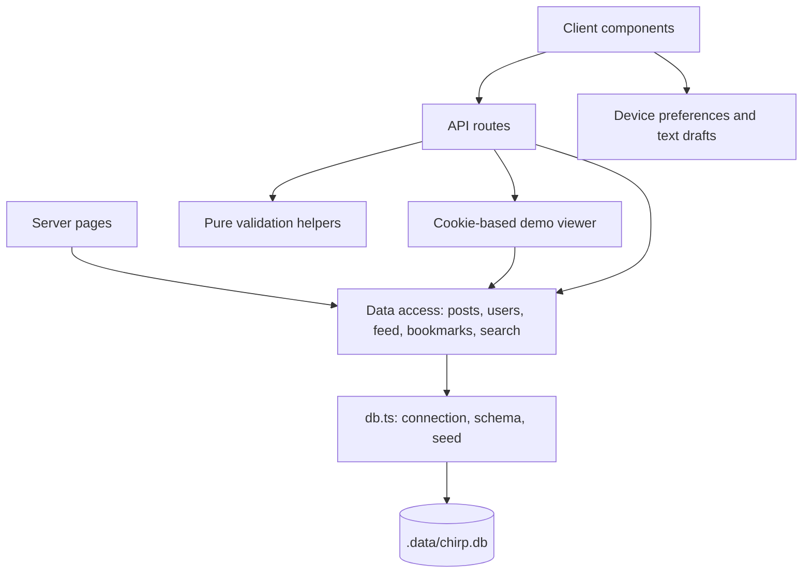

# Chirp architecture

Chirp is one Next.js App Router application running in a Node.js process. It
serves React views and JSON endpoints over a local SQLite database. There is no
queue, cloud storage, or external identity service.

## Dependency direction

The initial home feed is assembled by the server. Polling, user switching, and
mutations use API routes. Domain shapes live in `lib/types.ts`. Ranking and
localization are pure formatting/computation modules; they do not open a DB.

## Surfaces and entry points

| Surface   | Page                            | Main collaborators                        |
| --------- | ------------------------------- | ----------------------------------------- |
| Home      | `app/page.tsx`                  | Feed, ComposeBox, feed, ranking           |
| Explore   | `app/explore/page.tsx`          | SearchPanel, search, topics               |
| People    | `app/people/page.tsx`           | users, Avatar                             |
| Profile   | `app/profile/[handle]/page.tsx` | users, posts, ProfileEditor, ProfileStats |
| Saved     | `app/bookmarks/page.tsx`        | bookmarks, SavedPosts                     |
| Permalink | `app/post/[id]/page.tsx`        | posts, Post                               |
| Settings  | `app/settings/page.tsx`         | PreferencesProvider, SettingsPanel        |

The root layout supplies navigation, the community rail, and the client preference
context. It is dynamic because viewer state and community content are local data.

## Storage and startup

`getDb()` caches its connection on globalThis for development hot reloads. The
driver enables WAL, foreign keys, and a ten-second busy timeout. Schema creation
is idempotent. Seeding checks emptiness inside an immediate transaction so
concurrent connections cannot both insert the sample world. `CHIRP_DATA_DIR`
can isolate a test database; the default is `.data/` in the working directory.

Users own posts. Likes, reposts, and bookmarks join users to posts using composite
keys and cascading foreign keys. Uploaded bytes go to `public/uploads/`, outside
the database. Native SQLite is externalized from the Next.js server bundle.

## Operational boundaries

SQLite and writable local files require a persistent Node host. This starter is
not an edge-runtime or stateless multi-host deployment. Demo identity is an
unsigned selected-user cookie. The engineering contracts in AGENTS.md and feature
guides are the review criteria for API validation, ownership, SQL, uploads,
ranking, localization, and private data.
